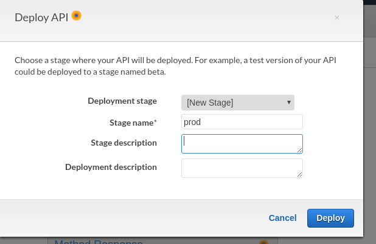

# How to Expose Lambda Function with API Gateway

### Do you need to return an HTML page, Json output, prometheus scrapped metrics, etc. from your API Gateway & Lambda? This Page is for you.
Reading time: 5 minutes

#### Why used API Gateway and Lambda? 
I was recently working with client where they want display custom HTML page.
The HTML page shows the data processed from particular database and display it in tabular format. 
Client only want to fetched data from database when its required and also they don't want to maintain any servers for processing and hosting site.
So, We decided to create an API Gateway and Lambda function to serve our needs. 

##### Overview
In this tutorial you'll first create a Lambda placeholder function that returns HTML and bind it to an API in API Gateway. 
The placeholder function will return a hard-coded HTML string. 
Once you have the skeleton in place you can replace this function with a more sophisticated version.

##### Lambda 

1) Log into to the AWS Console and navigate to the Lambda service.
2) Create a new Lambda function and select "Author from scratch".
3) Enter Function Name- html-demo, Runtime - Python 3.6 (you can select python version you want)
4) Choose/ Create New IAM role which gives correct permission to lambda function and click "Create Function".
5) Choose basic Settings like Memory and function Timeout. 
6) Open Lambda function and replace below code init 
```
import json

def lambda_handler(event, context):
    
    html_data="<html> <body> <center> <h2>Users List </h2> <table border=1><tr><td>User Name</td><td>User ID</td></tr>"
    html_data=html_data+"<tr><td>Vikrant</td><td>101</td></tr>"
    
    # TODO implement
    return {
        'statusCode': 200,
        'body': html_data,
        'headers': {
                'Content-Type': 'text/html'
        }
    }
```

Note: If your function needs to communicate with VPC then select VPC details accordingly.


##### API Gateway 

1) Navigate to the API Gateway service and select REST API - Develop a REST API where you gain complete control over the request and response along with API management capabilities.


2) Create a new API called html-response-api and Create a GET method on the root resource (/)


Setup GET Method, Choose -
**Integration type** - Lambda Function

**Use Lambda Proxy Integration** - Checked

**Lambda Region** - Region where Lambda is created

**Lambda Function** - html-demo

**Use Default Timeout** - Checked

3)Go to **Actions** dropdown and select "Create Resource"
Choose - 
**Configure as proxy resource** - Checked
Do **Create Resource**


4)Go to **Actions** dropdown and select "Deploy API"


5)Go to Stages - "Invoked URL" to see if API Enpoint is working  
